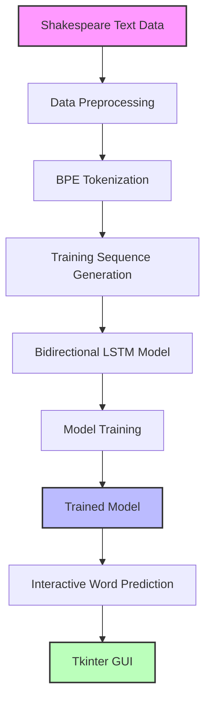
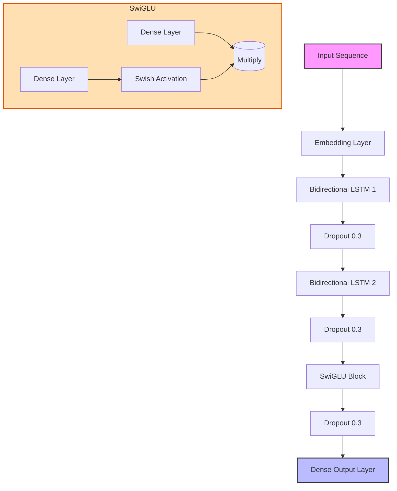
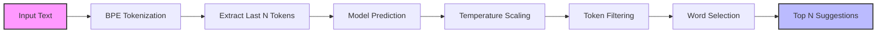

A sophisticated word completion system trained on Shakespeare's works that uses bidirectional LSTMs with Byte-Pair Encoding to suggest contextually appropriate words in real-time, preserving the distinct style of Shakespearean English.

## Overview

ShakespeareQuill provides an interactive environment where users can type text in a Shakespearean style and receive word suggestions that maintain the linguistic characteristics of Elizabethan English. The system uses:

- **Bidirectional LSTM architecture** for capturing both past and future context
- **Byte-Pair Encoding (BPE)** for handling archaic vocabulary and morphological variations
- **Temperature-controlled sampling** to balance predictability and creativity
- **Tkinter-based GUI** for real-time suggestions as you type

## System Architecture

The application follows a multi-stage pipeline from data processing to interactive prediction:



### LSTM Model Architecture

The neural network uses a bidirectional LSTM architecture with SwiGLU activation:



## Features

- **Authentic Shakespeare Style**: Captures the unique vocabulary, grammar, and style of Shakespearean English
- **Context-Aware Predictions**: Considers surrounding text to provide relevant word suggestions
- **Adjustable Creativity**: Temperature slider to control prediction randomness
- **User-Friendly Interface**: Simple GUI with keyboard shortcuts for efficient writing
- **Real-Time Suggestions**: Instantly updates predictions as you type

## Requirements

- Python 3.8+
- TensorFlow 2.8+
- NumPy
- Pandas
- Tokenizers (Hugging Face)
- Tkinter (Python's standard GUI toolkit)
- Matplotlib (for visualization)
- scikit-learn

You can install the required packages using:

```bash
pip install -r requirements.txt
```

Note: For Tkinter support, you may need to install additional system packages:
- Ubuntu/Debian: `sudo apt-get install python3-tk`
- Fedora/RHEL: `sudo dnf install python3-tkinter`
- macOS with Homebrew: `brew install python-tk`

## Dataset

The model is trained on Shakespeare's plays dataset from Kaggle:
[Shakespeare Plays Dataset](https://www.kaggle.com/datasets/kingburrito666/shakespeare-plays)

Place the dataset files in the `Data/` directory before running the application for the first time.

## Usage

1. Ensure the dataset is placed in the `Data/` directory
2. Run the application:
   ```bash
   main.py
   ```
3. Start typing in the text area
4. Select from suggested words using mouse clicks or Alt+1 through Alt+5 shortcuts
5. Adjust the temperature slider to control the creativity of suggestions

## Word Prediction Process

The word prediction algorithm processes input text through several stages:



## Training Process

If no pre-trained model is found, the application automatically trains a new model:

1. Loads Shakespeare's texts from the `Data/` directory
2. Preprocesses and tokenizes the text using BPE
3. Creates training sequences with context windows
4. Trains the BiLSTM model with early stopping and learning rate reduction
5. Saves the model and tokenizer for future use

## Performance

The model achieves approximately 33.69% training accuracy and 28.98% validation accuracy after 21 epochs, which is reasonable given the complexity and variability of Shakespearean language.

## Project Structure

```
LSTM-Word-Completion-for-Shakespearean-Text/
├── main.py                        # Main application file
├── requirements.txt               # Required dependencies
├── Data/                          # Directory for Shakespeare text files
├── shakespeare_bpe_model.keras    # Trained model (created after first run but too heavy for github)
└──  shakespeare_bpe_tokenizer/    # Tokenizer files (created after first run)
    ├── vocab.json
    └── merges.txt

